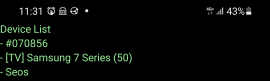
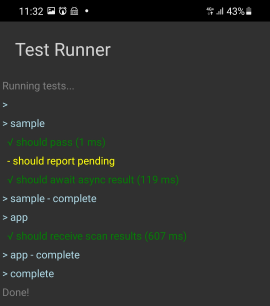

# Demo

This demo shows how to create a React Native app (which will display name of neaby BLE devices),
and then write fast and robust integration tests for this app using [@larsthorup/ble-mock-recorder](https://www.npmjs.com/package/@larsthorup/ble-mock-recorder/).

## Prerequisites

- An Android phone
- A Bluetooth device
- Android development setup (https://reactnative.dev/docs/environment-setup)

## Bootstrap the app

```bash
mkdir ble-demo
cd ble-demo
npx react-native init BleApp
cd BleApp
npm install react-native-ble-plx
```

## Code the app

- [`BleApp/App.js`](./App.js)
- [`BleApp/ble.js`](./ble.js)

## Run the app

```bash
npm run android
```

Your phone should show something like this, with names of nearby BLE devices:



## Bootstrap the recorder test app

```bash
cd ble-demo
npx react-native init BleAppRecorder --template @larsthorup/react-native-mocha-template
cd BleAppRecorder
```

## Code the recorder test

- [`BleAppRecorder/src/test/app.recorder.test.js`](./app.recorder.test.js)
- Change `expectedLocalName` to match your BLE device

## Run the recorder test

```bash
npm test
```

Your phone should show something like this:



## Set up the app test

```bash
cd BleApp
npm install @larsthorup/ble-mock-recorder
npm install @testing-library/react-native
```

Modify Jest configuration in `BleApp/package.json` to this:

```json
  "jest": {
    "preset": "react-native",
    "transformIgnorePatterns": [
      "node_modules/(?!(react-native|@react-native|react-native-ble-plx|@larsthorup)/)"
    ]
  }
```

Add:

- [`BleApp/__mocks__/react-native-ble-plx.js`](./react-native-ble-plx.js)

## Code the app test

- [`BleApp/__tests__/App-test.js`](./App-test.js)
- Change `expectedLocalName` to match your BLE device

## Run the app test

```bash
npm test
```

Your terminal should show something like this:


